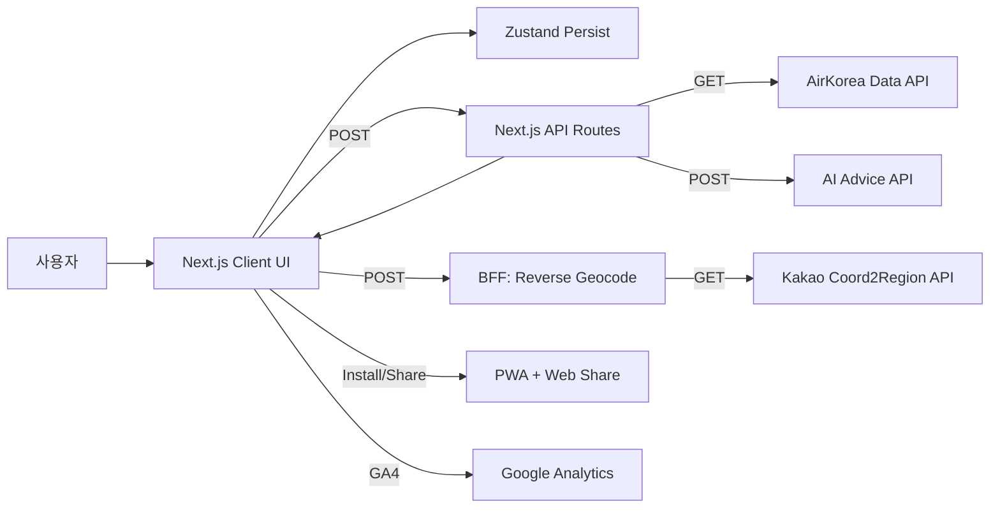
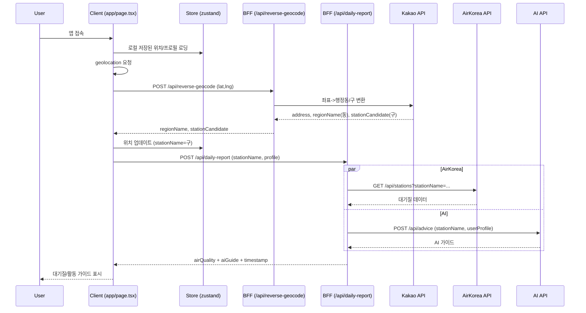

# EPI-LOG (에피로그)

대기질 기반 아이 활동 가이드 PWA. 사용자의 위치/프로필을 바탕으로 대기질 데이터와 AI 가이드를 통합해 보여줍니다.

## 기술 스택

- 프론트엔드: Next.js 16 (App Router), React 19, TypeScript 5
- 상태 관리: Zustand (persist, localStorage)
- 스타일/UX: Tailwind CSS 4, Framer Motion, Lucide Icons
- PWA: next-pwa, Web App Manifest, Service Worker
- 유틸: react-hot-toast, react-daum-postcode
- 분석: GA4 (gtag)
- 백엔드(BFF): Next.js API Routes
- 외부 연동: AirKorea 데이터 API, AI 서버 API, Kakao 지도(역지오코딩), Kakao JS SDK

## 시스템 아키텍처



## System Flow (Sequence Diagram)



## Architecture Overview

- 클라이언트 중심 PWA 구조이며, UI는 `app/page.tsx`에서 위치/프로필 기반 데이터를 요청합니다.
- BFF(`/app/api/*`)가 외부 데이터(대기질/AI)를 병렬로 호출하고 단일 응답으로 통합합니다.
- 위치는 브라우저 geolocation + Kakao 역지오코딩을 사용하고, UI 표시(동)와 데이터 매칭(구)을 분리합니다.
- 사용자 상태(위치/프로필)는 `zustand` + `persist`로 저장되어 재방문 시 복원됩니다.
- GA4 스크립트를 통해 페이지뷰 이벤트를 수집하며, PWA 설치/공유 UX를 제공합니다.

## 상세 기능 요구사항 (Functional Requirements)

1. 위치 기반 데이터 수집
   - 브라우저 위치 권한 요청 및 좌표 획득
   - 권한 거부/실패 시 기본 위치(강남구) 기준 데이터 제공
   - 위치 변경 시 즉시 재조회 및 토스트 피드백 제공
2. 역지오코딩 및 주소 검색
   - 좌표를 행정동/구 단위로 변환
   - UI 표시는 동(regionName), 데이터 요청은 구(stationCandidate) 사용
   - Daum 우편번호 검색으로 수동 위치 변경 지원
3. 사용자 프로필(온보딩)
   - 나이 그룹/건강 상태 선택
   - 제출 시 로컬 저장 및 맞춤 결과 표시
   - 설정 아이콘으로 재설정 가능
4. 대기질 + AI 가이드 통합 조회
   - AirKorea 데이터와 AI 가이드를 병렬로 요청
   - 외부 API 실패 시 폴백 응답으로 UI 안정성 확보
5. 맞춤 가이드 표시
   - 대기질 등급별 색상 표시
   - AI 요약/상세 이유/행동 지침/근거 자료 표시
   - 마스크/활동 권장 라벨 표시
6. 공유 및 PWA
   - Web Share API 기반 공유(지원 불가 시 클립보드 복사)
   - iOS/Android 설치 프롬프트 제공
7. 분석/로그
   - GA4 페이지뷰 자동 수집 (URL path/query 포함)

## API 명세 (Backend Endpoints)

### 1) `POST /api/daily-report`

대기질 데이터(AirKorea)와 AI 가이드를 통합하는 BFF 엔드포인트.

**Request Body**
```json
{
  "stationName": "강남구",
  "profile": {
    "ageGroup": "child_low",
    "condition": "rhinitis"
  }
}
```

**Response**
```json
{
  "airQuality": {
    "stationName": "강남구",
    "grade": "BAD",
    "pm25_value": 55,
    "pm10_value": 88,
    "o3_value": 0.07,
    "no2_value": 0.04,
    "temp": 22,
    "humidity": 45,
    "detail": { "pm10": { "grade": 3, "value": 88 }, "pm25": { "grade": 3, "value": 55 } }
  },
  "aiGuide": {
    "summary": "실외 활동 가능합니다",
    "detail": "미세먼지 수치가 낮습니다.",
    "activityRecommendation": "실외 활동 가능",
    "maskRecommendation": "KF80 권장",
    "actionItems": ["충분한 수분 섭취", "야외 활동 권장"],
    "references": ["WHO Guidelines 2024"]
  },
  "decisionSignals": {
    "pm25Grade": 3,
    "o3Grade": 2,
    "adjustedRiskGrade": 3,
    "finalGrade": "BAD"
  },
  "reliability": {
    "status": "LIVE",
    "label": "실시간 측정소 데이터",
    "resolvedStation": "강남구"
  },
  "timestamp": "2026-01-28T12:34:56.789Z"
}
```

**특이사항**
- 내부 프로필 스키마를 AI 서버 스키마로 매핑하여 전달합니다.
- AirKorea 응답을 UI 친화 구조로 평탄화(grade/detail + 주요 수치)합니다.
- Air/AI를 병렬 호출(`Promise.allSettled`)하고 부분 실패 시에도 degraded 응답으로 UI를 보호합니다.
- O3 규칙(2~5시), 영아 마스크 금지, 온습도 보정 신호(`decisionSignals`)를 포함합니다.
- 데이터 신뢰성 메타(`reliability`)를 함께 반환합니다.

**에러 처리**
- 내부 오류 시 `500`

**외부 호출**
- `GET ${NEXT_PUBLIC_DATA_API_URL}/api/air-quality?stationName=...`
- `POST ${NEXT_PUBLIC_AI_API_URL}/api/advice`

---

### 2) `POST /api/reverse-geocode`

좌표를 행정동/구 단위로 변환하는 역지오코딩 엔드포인트.

**Request Body**
```json
{
  "lat": 37.5172,
  "lng": 127.0473
}
```

**Response**
```json
{
  "address": "서울특별시 강남구 역삼1동",
  "regionName": "역삼1동",
  "stationCandidate": "강남구"
}
```

**에러 처리**
- `lat/lng` 누락 시 `400`
- `KAKAO_REST_API_KEY` 누락 시 `500`
- Kakao API 실패 시 `500`

## 환경 변수

- `NEXT_PUBLIC_DATA_API_URL`: AirKorea 데이터 API URL
- `NEXT_PUBLIC_AI_API_URL`: AI 서버 API URL
- `KAKAO_REST_API_KEY`: Kakao 지도 REST API Key
- `NEXT_PUBLIC_KAKAO_JS_KEY`: Kakao JS SDK Key
- `NEXT_PUBLIC_SITE_URL`: 배포 URL
- `NEXT_PUBLIC_GA4_ID`: Google Analytics ID

## 개발 실행

```bash
npm run dev
```
