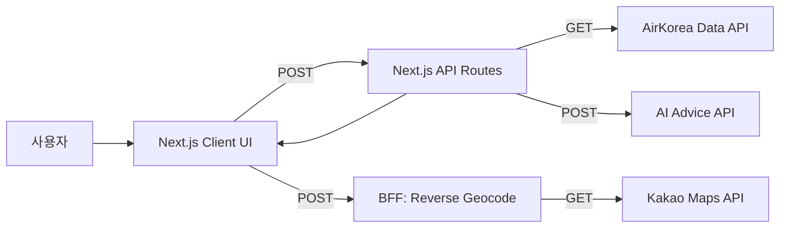
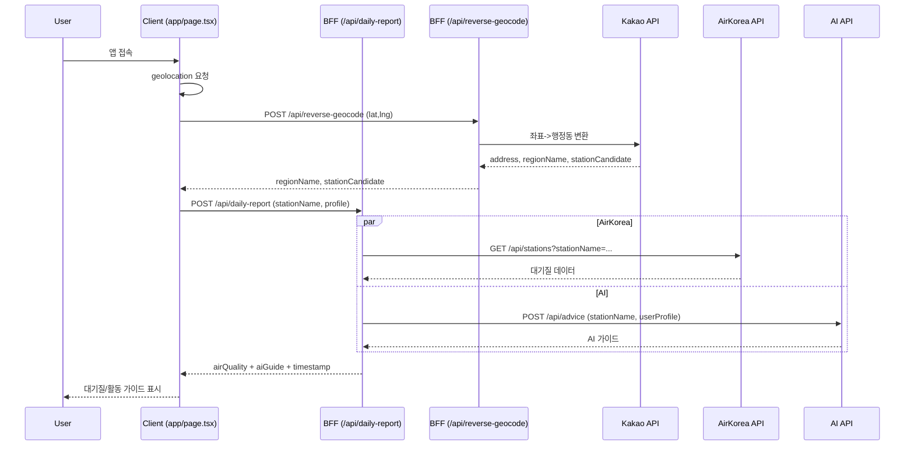

# EPI-LOG (에피로그)

대기질 기반 아이 활동 가이드 PWA. 사용자의 위치/프로필을 바탕으로 대기질 데이터와 AI 가이드를 통합해 보여줍니다.

## 기술 스택

- 프론트엔드: Next.js 16 (App Router), React 19, TypeScript 5
- 상태 관리: Zustand (persist)
- 스타일/UX: Tailwind CSS 4, Framer Motion, Lucide Icons
- PWA: next-pwa
- 유틸: react-hot-toast, react-daum-postcode
- 백엔드(BFF): Next.js API Routes
- 외부 연동: AirKorea 데이터 API, AI 서버 API, Kakao 지도(역지오코딩)

## 시스템 아키텍처



## System Flow (Sequence Diagram)



## Architecture Overview

- 클라이언트 중심 PWA 구조로, UI는 `app/page.tsx`에서 위치/프로필 기반 데이터를 요청합니다.
- BFF(`/app/api/*`)가 외부 데이터(대기질/AI)를 통합해 프론트엔드에 단일 응답으로 전달합니다.
- 위치는 브라우저 geolocation과 Kakao 역지오코딩을 사용하며, 행정동 표시와 구 단위 station 매칭을 분리합니다.
- 사용자 프로필/위치 상태는 `zustand` + `persist`로 로컬 저장됩니다.

## 상세 기능 요구사항 (Functional Requirements)

1. 위치 기반 데이터 수집
   - 브라우저 위치 권한 요청 및 좌표 획득
   - 좌표 실패 시 기본 위치(서울 중구/강남구) 기준으로 제공
   - 위치 변경 시 재조회 및 토스트 피드백 제공
2. 역지오코딩
   - 위/경도를 행정동 및 구 단위로 변환
   - UI 표시는 동(regionName), 데이터 요청은 구(stationCandidate) 사용
3. 사용자 프로필 입력(온보딩)
   - 나이 그룹/건강 상태 선택
   - 입력 완료 시 로컬 저장 및 맞춤 결과 표시
4. 대기질 + AI 가이드 통합 조회
   - 대기질(실시간) 데이터와 AI 가이드를 병렬로 요청
   - 실패 시 사용자에게 안내 메시지 제공 및 UI 안전 폴백
5. 맞춤 가이드 표시
   - 대기질 등급 색상 표시
   - AI 요약/상세 이유/행동 지침/참고 자료 표시
   - 마스크/활동 권장 레이블 표시
6. 공유 및 PWA 기능
   - 현재 결과 기반 공유 문구 생성
   - PWA 설치 프롬프트 제공

## API 명세 (Backend Endpoints)

### 1) `POST /api/daily-report`

대기질 데이터(AirKorea)와 AI 가이드를 통합하는 BFF 엔드포인트.

**Request Body**
```json
{
  "stationName": "강남구",
  "profile": {
    "ageGroup": "child_low",
    "condition": "rhinitis"
  }
}
```

**Response**
```json
{
  "airQuality": {
    "stationName": "강남구",
    "grade": "GOOD",
    "value": 32,
    "detail": { "pm10": { "grade": 1, "value": 32 }, "pm25": { "grade": 1, "value": 16 } }
  },
  "aiGuide": {
    "summary": "실외 활동 가능합니다",
    "detail": "미세먼지 수치가 낮습니다.",
    "activityRecommendation": "실외 활동 가능",
    "maskRecommendation": "KF80 권장",
    "actionItems": ["충분한 수분 섭취", "야외 활동 권장"],
    "references": ["WHO Guidelines 2024"]
  },
  "timestamp": "2026-01-28T12:34:56.789Z"
}
```

**에러 처리**
- 외부 API 실패 시에도 UI가 깨지지 않도록 `airQuality`와 `aiGuide`에 폴백 응답 제공
- 내부 에러 시 `500` 반환

**외부 호출**
- `GET ${NEXT_PUBLIC_DATA_API_URL}/api/stations?stationName=...`
- `POST ${NEXT_PUBLIC_AI_API_URL}/api/advice`

---

### 2) `POST /api/reverse-geocode`

좌표를 행정동/구 단위로 변환하는 역지오코딩 엔드포인트.

**Request Body**
```json
{
  "lat": 37.5172,
  "lng": 127.0473
}
```

**Response**
```json
{
  "address": "서울특별시 강남구 역삼1동",
  "regionName": "역삼1동",
  "stationCandidate": "강남구"
}
```

**에러 처리**
- `lat/lng` 누락 시 `400`
- `KAKAO_REST_API_KEY` 누락 시 `500`
- Kakao API 실패 시 `500`

## 환경 변수

- `NEXT_PUBLIC_DATA_API_URL`: AirKorea 데이터 API URL
- `NEXT_PUBLIC_AI_API_URL`: AI 서버 API URL
- `KAKAO_REST_API_KEY`: Kakao 지도 REST API Key
- `NEXT_PUBLIC_SITE_URL`: 배포 URL
- `NEXT_PUBLIC_GA4_ID`: Google Analytics ID

## 개발 실행

```bash
npm run dev
```
