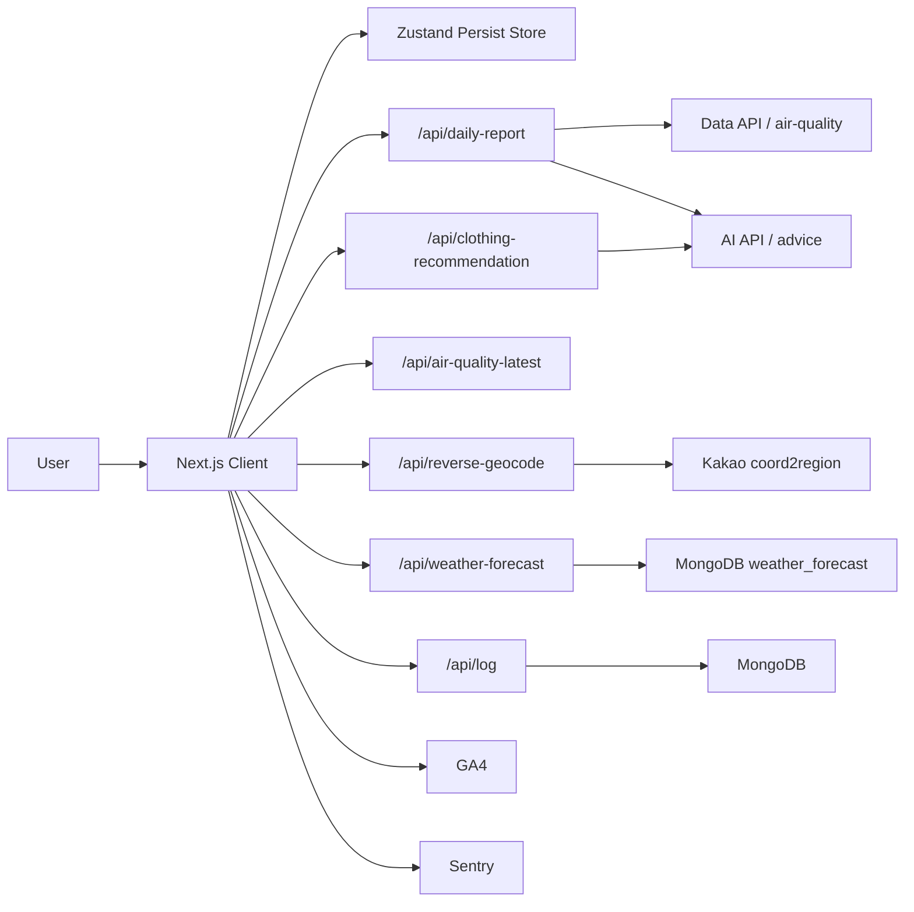

# EPI-LOG (아이숨, AI-Soom)

대기질과 사용자 프로필(연령/질환)을 결합해 아이 활동 가이드를 제공하는 서비스입니다.  
이 저장소는 **웹 PWA(Next.js)** 와 **Apps in Toss 미니앱(Vite)** 을 함께 관리합니다.

> 이 문서는 **2026-03-06 기준 코드 상태**를 반영합니다.

## 1. 프로젝트 구성

- `web`(루트): Next.js 16 App Router 기반 PWA + BFF API
- `miniapp`: `miniapps/ait-webview` (Apps in Toss WebView용 앱)
- 공통 핵심 로직: 의사결정/신뢰성 보정/프로필 정규화/분석 이벤트 컨텍스트

## 2. 현재 구현된 핵심 기능

### 2.1 사용자 흐름

1. 위치 권한 또는 주소 검색으로 지역을 선택
2. `/api/reverse-geocode`로 좌표를 행정구역/측정소 후보로 변환
3. `/api/daily-report`로 대기질 + AI 가이드를 병렬 조회
4. UI 카드(히어로/행동 체크리스트/근거/수치)를 표시
5. 백그라운드에서 `/api/air-quality-latest`를 60초 주기로 갱신
6. 옷차림 모달 오픈 시 `/api/weather-forecast`로 48시간 예보를 조회
7. 공유/설치/로그 이벤트를 수집

### 2.2 의사결정 규칙

- `pm2.5`, `o3` 기준으로 기본 위험도 계산
- 오존 고위험 시 행동 가이드에 `오후 2~5시 외출 금지` 강제 반영
- 영아(`infant`)는 마스크 권고를 금지 문구로 교체하고 위험 행동 문구 제거
- 연령/질환 + 온습도 기반 가중(천식/비염/아토피 및 저습/저온/고온 조건)
- 최종 의사결정 신호를 `decisionSignals`로 반환

### 2.3 신뢰성(측정소 보정)

- 주소 기반 측정소 후보군을 생성하고 순차 조회
- 시도(`sido`) 불일치 응답은 필터링
- 알려진 "미확인 측정소 시그니처"는 무효로 간주 후 다음 후보 시도
- 결과 상태를 아래 3단계로 표기
- `LIVE`: 선택 지역 실측 반영
- `STATION_FALLBACK`: 인근 측정소 자동 보정
- `DEGRADED`: 실측 매칭 실패로 대체 데이터 사용

### 2.4 AI 타임아웃/재시도/복구

- 1차 AI 호출 타임아웃 기본값은 6500ms
- 재시도는 기본 2회(총 3회 시도), 재시도 타임아웃 기본값 1600ms
- 재시도 백오프는 제곱 증가(기본 150ms, 600ms, ...)
- `timeout`, 네트워크 오류, `408/429/5xx`는 재시도 대상으로 처리
- 실시간 AI 응답 실패 시 최근 캐시(stale, 기본 30분)로 복구 시도

### 2.5 UI/UX

- Hero + 체크리스트 + 근거 Drawer + 실시간 수치 DataGrid
- 질환 복수 선택 + 사용자 직접 입력(최대 5개) 지원
- 옷차림 추천 모달(웹): `/api/clothing-recommendation` + 실패 시 서버 폴백
- 옷차림 모달에서 48시간 날씨(`/api/weather-forecast`) 함께 표시
- 지연 데이터 배지 및 수동 재조회 버튼
- Web Share API 우선, 미지원 시 클립보드 복사
- 비-TOSS 환경에서만 PWA 설치 코치 노출

### 2.6 계측/로그

- GA4 페이지뷰 및 코어 이벤트(`location_changed`, `profile_changed`, `share_clicked`, `retry_clicked` 등)
- UTM 저장/전파
- `session_end`(beacon) 포함 사용자 이벤트를 `/api/log`로 적재(미설정 시 skip)
- Sentry 태그/컨텍스트 연동(측정소, 신뢰성 상태, 프로필)

## 3. 웹 아키텍처(요약)


```mermaid
flowchart LR
  U["User"] --> UI["Next.js Client"];
  UI --> S["Zustand Persist Store"];
  UI --> DR["/api/daily-report"];
  UI --> RG["/api/reverse-geocode"];
  UI --> AL["/api/air-quality-latest"];
  UI --> CR["/api/clothing-recommendation"];
  UI --> WF["/api/weather-forecast"];
  DR --> AIR["Data API / air-quality"];
  DR --> AI["AI API / advice"];
  RG --> KAKAO["Kakao coord2region"];
  CR --> AI;
  UI --> LOG["/api/log"];
  LOG --> MDB["MongoDB"];
  WF --> WDB["MongoDB weather_forecast"];
  UI --> GA["GA4"];
  UI --> SEN["Sentry"];
```

## 4. API 엔드포인트 (웹 루트)

- `POST /api/daily-report`
- 대기질/AI 병렬 조회
- 측정소 후보 보정 + 신뢰성 메타 + 의사결정 신호 반환

- `GET /api/air-quality-latest?stationName=...`
- 경량 실시간 대기질 갱신용 엔드포인트

- `POST /api/clothing-recommendation`
- 온습도 기반 옷차림 추천
- AI 실패 시 BFF 내 규칙 폴백

- `POST /api/reverse-geocode`
- 좌표 -> 주소/표시지역/측정소 후보 변환 (Kakao API)

- `GET /api/weather-forecast?stationName=...`
- MongoDB(`weather_forecast.weather_forecast_data`) 기반 48시간 예보 반환

- `POST /api/log`
- 세션 단위 사용자 이벤트 적재(V2 batch + legacy 단건 지원)
- `MONGODB_URI` 미설정 시 `202` + `skipped=true`로 수집만 스킵

더 자세한 스펙은 [API_GUIDE.md](./API_GUIDE.md) 참고.

## 5. 디렉터리 구조

```text
.
├─ app/                       # Next.js App Router + API routes
├─ components/                # 웹 UI 컴포넌트
├─ hooks/                     # 로깅/트래킹 훅
├─ lib/                       # 의사결정/신뢰성/분석 유틸
├─ models/                    # MongoDB 모델(UserLog)
├─ store/                     # Zustand 스토어
├─ tests/
│  ├─ unit/                   # Vitest 단위 테스트
│  └─ e2e/                    # Playwright E2E
├─ scripts/                   # 신뢰성 스모크 등 운영 스크립트
├─ miniapps/ait-webview/      # Apps in Toss 미니앱(Vite)
└─ output/                    # 테스트/스모크 산출물
```

## 6. 환경 변수

### 6.1 웹(루트)

- `NEXT_PUBLIC_DATA_API_URL`
- `NEXT_PUBLIC_AI_API_URL`
- `KAKAO_REST_API_KEY`
- `NEXT_PUBLIC_KAKAO_JS_KEY`
- `NEXT_PUBLIC_SITE_URL`
- `NEXT_PUBLIC_GA_ID` 또는 `NEXT_PUBLIC_GA4_ID`
- `NEXT_PUBLIC_SENTRY_DSN` (옵션)
- `SENTRY_ORG` (소스맵 업로드/Next.js 플러그인 사용 시)
- `SENTRY_PROJECT` (소스맵 업로드/Next.js 플러그인 사용 시)
- `SENTRY_AUTH_TOKEN` (소스맵 업로드 시)
- `SENTRY_RELEASE` (옵션, 릴리즈 식별자 고정 시)
- `MONGODB_URI`
- `MONGODB_DB` (옵션)
- `NEXT_PUBLIC_PLATFORM` (`TOSS`일 때 공유/PWA 설치 UI 일부 비노출)
- `DAILY_REPORT_AI_TIMEOUT_MS`
- `DAILY_REPORT_AI_PRIMARY_RETRY_COUNT`
- `DAILY_REPORT_AI_PRIMARY_RETRY_TIMEOUT_MS`
- `DAILY_REPORT_AI_PRIMARY_RETRY_BACKOFF_MS`
- `DAILY_REPORT_AI_RETRY_TIMEOUT_MS`
- `DAILY_REPORT_AI_CACHE_TTL_MS`
- `DAILY_REPORT_AI_CACHE_MAX_ENTRIES`
- `DAILY_REPORT_AI_CACHE_STALE_MS`
- `DAILY_REPORT_AIR_TIMEOUT_MS`
- `DAILY_REPORT_AIR_TOTAL_BUDGET_MS`
- `DAILY_REPORT_AIR_MAX_CANDIDATES`
- `DAILY_REPORT_AIR_CACHE_TTL_MS`
- `DAILY_REPORT_AIR_CACHE_MAX_ENTRIES`
- `DAILY_REPORT_AIR_CACHE_STALE_MS`
- `LOG_ALERT_WINDOW_MS`
- `LOG_ALERT_MAX_5XX_RATE`
- `LOG_ALERT_MIN_REQUESTS_5XX`
- `LOG_ALERT_MAX_DROP_RATE`
- `LOG_ALERT_MIN_EVENTS_DROP`
- `LOG_ALERT_MAX_FALLBACK_EXPOSED_RATIO`
- `LOG_ALERT_MIN_PAGEVIEWS_FALLBACK`
- `LOG_ALERT_MAX_SHARE_FAILURE_RATIO`
- `LOG_ALERT_MIN_SHARE_ATTEMPTS`

### 6.2 미니앱(`miniapps/ait-webview`)

- `VITE_GA_ID`
- `VITE_API_BASE` (웹 BFF 베이스 URL)
- `VITE_SENTRY_DSN`
- `VITE_SENTRY_ENVIRONMENT`
- `VITE_SENTRY_RELEASE`
- `VITE_SENTRY_TRACES_SAMPLE_RATE`

## 7. 로컬 실행

### 7.1 웹(루트)

```bash
npm install
npm run dev
```

기타 명령:

- `npm run build`
- `npm run start`
- `npm run lint`
- `npm run test:unit`
- `npm run test:e2e`
- `npm run test:e2e:ui`
- `npm run test:e2e:ci`

### 7.2 미니앱

```bash
cd miniapps/ait-webview
npm install
npm run dev
```

기타 명령:

- `npm run build`
- `npm run lint`
- `npm run deploy`

## 8. 테스트/검증

- 단위 테스트: 의사결정 로직, 측정소 후보 보정, 일일 리포트 재시도, 의류 추천 route, 로그 적재 route, 미니앱 헬퍼 로직
- E2E 테스트: 핵심 대시보드 흐름, 로딩/실패 복구, 프로필/위치 갱신, 공유 CTA, 근거/신뢰성 UI
- CSV 계약 시나리오 검증: `tests/e2e/decision-csv.spec.ts`에서 `tests/fixtures/decision-data.csv` 순회

신뢰성 스모크(수동):

```bash
node scripts/nationwide-reliability-smoke.mjs \
  --base-url http://127.0.0.1:4012 \
  --fixture scripts/fixtures/nationwide-stations.sample.json
```

산출물은 `output/nationwide-reliability/`에 생성됩니다.

## 9. 운영 메모

- `next-pwa`는 개발환경에서 비활성화, 프로덕션에서 Service Worker 생성
- Sentry는 DSN이 있을 때만 런타임에서 활성화되고, `SENTRY_ORG`/`SENTRY_PROJECT`가 있을 때만 Next.js 빌드 플러그인이 활성화됨
- `/api/*` 라우트는 CORS 헤더를 반환
- `/api/log`는 MongoDB 미설정 시 `202(skipped)`로 응답하고 저장은 생략
- `/api/weather-forecast`는 MongoDB(`weather_forecast`) 데이터 소스가 필요

## 10. Sentry 계정 교체 가이드

기존 Sentry 계정에서 새 계정으로 옮기려면:

1. 배포 환경(Vercel 등)에서 기존 `NEXT_PUBLIC_SENTRY_DSN`, `SENTRY_ORG`, `SENTRY_PROJECT`, `SENTRY_AUTH_TOKEN`, `SENTRY_RELEASE` 값을 제거합니다.
2. 새 Sentry 계정에서 프로젝트를 만든 뒤 새 DSN을 `NEXT_PUBLIC_SENTRY_DSN`으로 등록합니다.
3. Next.js 소스맵 업로드까지 사용할 경우 새 계정의 `SENTRY_ORG`, `SENTRY_PROJECT`, `SENTRY_AUTH_TOKEN`도 함께 등록합니다.
4. 미니앱을 별도 프로젝트로 운영할 경우 `miniapps/ait-webview` 쪽 `VITE_SENTRY_DSN`과 sourcemap 업로드용 `SENTRY_ORG`, `SENTRY_PROJECT`, `SENTRY_AUTH_TOKEN`도 새 값으로 교체합니다.
5. 새 값이 모두 들어오기 전까지는 코드상 Sentry 플러그인이 비활성화되므로 예전 계정으로 업로드되지 않습니다.

참고:
- 미니앱은 Vite `envPrefix`에 `NEXT_PUBLIC_`도 허용해 shared build env의 `NEXT_PUBLIC_SENTRY_DSN`을 fallback으로 읽을 수 있습니다.
- 그래도 배포 경로가 Vercel이 아닌 경우에는 `miniapps/ait-webview/.env` 또는 해당 CI 환경에 `VITE_SENTRY_DSN`을 직접 넣는 편이 안전합니다.

## 11. 관련 문서

- [API_GUIDE.md](./API_GUIDE.md)
- [TEST_CASES.md](./TEST_CASES.md)
- [miniapps/ait-webview/README.md](./miniapps/ait-webview/README.md)
